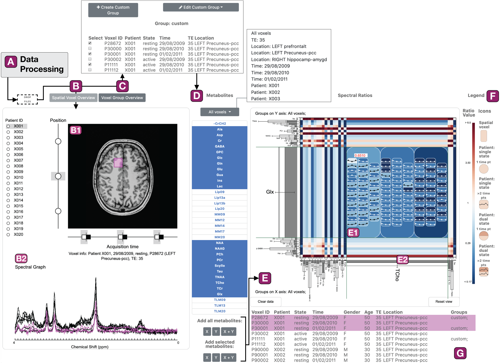

# SpectraMosaic Analysis Tool
SpectraMosaic is an exploratory tool developed for the interactive visual analysis of magnetic resonance spectroscopy, or MRS, data. It is the first of its kind to allow comparison of spectral metabolite concentration ratios across multiple dimensions at group and individual levels, and is the product of an interdisciplinary collaboration initiative between visualization researchers, clinicians, and MR physicists and engineers at the University of Bergen, Mohn Medical Imaging and Visualization Centre, and Haukeland University Hospital in Bergen, Norway. 

Full overview of SpectraMosaic, a visual exploratory application designed for MR spectroscopy researchers, identified in order of user workflow and tasks: Data loader (A) for processed spectral data, followed with the spectral voxel overview (B) with patient, region of interest (ROI), time, and state selection (B1) and associated spectral graphs per voxel (B2). Following quality review of voxels, users switch to (C) voxel group overview to create custom analysis groups in C1, or move immediately to group selection based on preallocated group structures. Voxel custom group membership is listed as a column in the metadata table (G). Panel D allows for specific metabolite selection or entirety of selection of a metabolite basis set by grouping from (C), which can then be added to either axis of the spectral ratio heatmap (E). E1 shows the ratio heatmap as an overview, with E2 demonstrating an expanded detail view of a particular ratio of interest, with fine-grained information for ROI and patient values for this ratio. Finally, a legend (F) keys ratios to color and glyphs to either spatial, patient, time, or brain state voxel for more rapid interpretation. Brushing and linking mechanisms preserve data element coherency.

## What is MRS? 
MRS is a non-invasive biochemical imaging technique utilized in clinical research for a range of neuropsychiatric diseases. Current toolsets for MR spectroscopy visual analysis are limited and often restricted to visualization of spectra for a single voxel, for a single patient, at a single time.

## Using SpectraMosaic
### Upstream processing steps for analysis
To use this application, you need to have performed a number of preprocessing steps with the initial spectral acquisition. This tool is downstream of the spectral voxel registration and model fitting steps. At this time, we are unable to include the automatic processing steps necessary, but we are working on making this part of the pipeline publicly available. 

## File and Directory Structure Requirements
### Structural image 
Structural reference images need to, as of this version (1.9.2019) require 3 `.png` files for each plane (axial, coronal, sagittal) with the voxel drawn and baked into the image. In the visual tool we only show the axial image, but you can customize as you like. 

### Spectral graph 
We use [Tarquin](http://tarquin.sourceforge.net/), an open-source spectral processing and quantification tool for pre-processing the spectral graph data. From Tarquin, export the CSV results and fits spreadsheets, and save these as `PXXXXX_results.csv` and `PXXXXX_fits.csv`, respectively. We include in `sample_data` directory some sample files to see how this should look. 

### Directory structure
The python routine above will output this for you, but if you are rearranging or doing any of this on your own, you will need a project hierarchy setup with the following structure:
- root
    - patient_xxx
        - voxel_xxx
        - voxel_xxx
    - patient_xxx
        - voxel_xxx
        - voxel_xxx
    - ___header_info.csv

NB: You will get a validation error if your structure is not set like this. As an example structure we have a test data folder loaded that has already done through the preparatory script - see `giardiaFullMetab_spatial` or `giardiaFullMetab_diffTE` as reference datasets. Either of these can be dropped directly into the application interface in the drop zone (A in the figure above). You can load both sequentially. 

### Workflow example
SpectraMosaic consists of 2 main views: the left provides for spectral inspection and customized group creation while the right serves as the spectral analysis interface in the form of a heatmap matrix. 

With SpectraMosaic users are primarily interested in assessing group versus individual variation of metabolites in ratio form. These comparisons may be for similarity assessment, where subtle differences are important to track, as well as for large difference assessments such as those seen in tumor studies, or in research cases, where echo time is varied.  

 Our demonstration case we discuss is `giardiaFullMetab_spatial`, a Giardia case study acquired with single-voxel PRESS, where we look at possible neuroinflammation in 3 different brain locations compared for 2 different patients. 

Following data preprocessing and quantification in an offline routine,  study data are loaded into the application using a drag and drop window feature -- these data remain linked semantically in the application to ensure continuity between voxel location, its spectral output, and patient-specific information.

We see our patient selector panel on the left - radial buttons allow display of one patient with associated acquisition data at a time. 

Here we have selected the first patient, and can see in the image view the three voxel regions acquired for this patient, arrayed along this vertical axis. A horizontal axis indicates the number of different time acquisitions performed for this voxel — in this case we are interested in looking at only one time acquisition. 

Hover or selection of each voxel node calls the spectral graph for the voxel below, as well as additional information such as voxel ID, echo time used in the acquisition protocol. 
 
To compare metabolites against eachother, we can either select an automatically-created group immediately from the metabolite selector panel, or we can create a more customized group for analysis using the voxel group overview panel. In this view, we can create a custom group, and update the membership -- we see membership for our custom group in the bottom right table, which automatically updates accordingly. 

In this case we interested in comparing all spatial voxels of one patient to all spatial voxels of the other patient. Once both axes have spectral metabolites attached a heatmap matrix is drawn onscreen; the matrix size is determined by the number of metabolites added as inputs -- users can select a subset of metabolites to review, or all.  

This drawing updates as the inputs are changed. 

As we hover over the table cells we can easily see the metabolites from each axis that are used in ratio calculations -- the height of the metabolite bar encodes, in the case of this group, the median concentration, with whiskers extending to indicate the range. 

We use a diverging colormap: white indicates the compared metabolites are equal, red indicates the x-axis metabolite is greater, while blue indicates a larger y-axis metabolite. Increased saturation indicates a greater difference between the two. 

Each cell can be expanded to show detailed metabolite ratio information for a given cell. For instance, perhaps we would like to inspect individual ratio variation for Lactate against Total Creatine for this study, since Lactate is often elevated in giardia infection. 

On expansion we can see that as we hover over elements, associated patient spectra and voxel locations are highlighted in fuschia in the left view, and the corresponding table row, or rows, which contain useful information about the patient voxel sample. 

A legend at the right lists the key visual elements and maps their shape and color. 

We can see through the similar hues of the colormap that both patients are quite similar between the prefrontal and precuneus voxels, but the hippocampal region shows a large difference, indicating that Lac and TCr have strongly differing levels in this area. This arises from the female patient, since the male patient had no recorded lactate, indicated by the grey color. We can confirm with the whiskers on the bars that there is a large input range also for lactate that causes this variation. However, the red tooltip indicates that the model fit for this metabolite to the raw spectrum may not be reliable, and needs further investigation.  

Subtleties like this would be difficult to understand through visualization of the spectral graph or through statistical measures alone. 

If we wish to reset the heatmap canvas we can simply click the reset view button at the bottom right of the interface to return to our overview state. To clear the heatmap canvas and allow for new group inputs, we click the clear data button.

